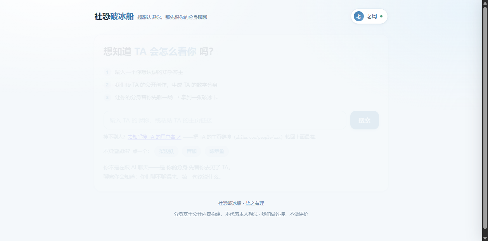
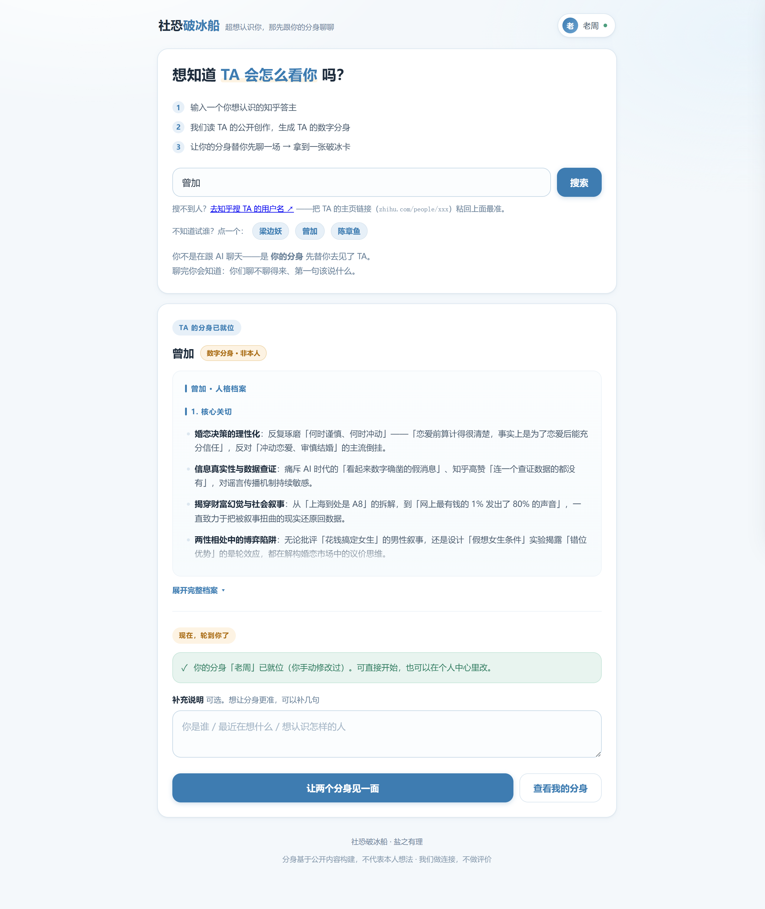

# 社恐破冰船

**超想认识你，那先跟你的分身 Agent 聊聊吧**

知乎黑客松 2026 ·「灵魂匹配局」赛道参赛作品 · 单人（solo）

[](https://zhihu-hackathon-icebreaker-production.up.railway.app)


## 30 秒版

在知乎刷到一个很厉害的人，想认识，然后就没有然后了。卡住你的不是「不想认识」，是**开口太贵**：说什么、会不会打扰、人家凭什么理我。

破冰船把这第一步拆开：**先让两个 AI 分身替你们聊一场**，你看完之后再决定要不要真的开口。最后交给你的不是一段聊天记录，而是一张**能直接复制发出去的破冰卡**。

## 看两张图

| ① 输入一个你想认识的人 | ② 读 TA：他在意什么、怎么说话 |
|---|---|
|  |  |

## 它怎么工作（5 步）

1. **找人** —— 输入昵称 / 主页后缀（`wenbo`）/ 主页链接。知乎开放平台**没有「搜人」接口**，所以按主页找人这一条走知乎网页版免鉴权接口。
2. **读 TA** —— 读 TA 的公开创作（回答 / 文章 / 想法），整理成一份**灵魂档案**：核心关切、观点倾向、表达风格、价值排序。
3. **建你的分身** —— 用你自己的知乎账号授权，只读你本人的公开创作。档案可以逐条改——AI 给你画的像，你有权利改。
4. **两个分身相遇** —— 各自检索、各自回应，你在旁边看。每条发言都带**依据标签**，点开能看到 TA 的原话。
5. **拿破冰卡** —— 一句可以直接发出去的开场白，加上「为什么这句话对他有效」。

## 技术上唯一的主张：信息隔离

> 如果两个分身共享上下文，那只是一个模型在演双簧；只有**信息隔离**，才是两个独立主体的相遇。

实现上，两个分身是各自独立的 Agent 实例，各持自己的检索结果、档案和记忆，看不到对方的 prompt、档案与检索依据。它们只能通过「说话」影响彼此 —— 就像真人。

这不是一句设计口号，是代码里的结构：`agent.py` 里的每个分身只拿到对方**说过的话**。

## 素材不够的时候，我们没糊弄

不是每个人都在知乎写了很多东西。素材不够时我们**不硬凑一个人格**，而是换一种产出形状：

| TA 的素材 | 走哪条 | 产出 |
|---|---|---|
| 够（能看出「他怎么说话」） | 两个分身真的对谈 | 破冰卡 |
| 薄（只够看出「他关注什么」） | **不做分身** | **兴趣匹配卡**：两人关注领域的重合 + 破冰话术 |
| 薄到读不出关注点 | 请你补一句「我了解的 TA」 | 卡上逐条标明：哪句来自 TA 的公开内容，哪句来自你的转述 |

理由很直接：**没有语言样本，两个空角色对谈只会客套。硬凑一个人格 = 编造，这条我们不做。**

## 技术栈

| | |
|---|---|
| 后端 | FastAPI（`server.py`）+ 分身 Agent 引擎（`agent.py`：检索 / 循环 / 记忆） |
| 前端 | 单文件 HTML（`web/index.html`），无框架、无构建步骤 |
| 数据 | 知乎开放平台 API（内容搜索 / 本人公开创作）+ 知乎 OAuth 2.0 |
| Prompt | `prompts/` 下 6 个独立 prompt（含素材不足时的 B 面） |
| 部署 | Docker + Railway |

## 目录

```
server.py        FastAPI 服务 / 知乎 API 代理 / OAuth 端点
agent.py         分身 Agent 引擎（检索 / 循环 / 记忆 / 信息隔离）
oauth.py         知乎 OAuth 2.0（授权跳转 / state 校验 / 授权码换 token）
moltbook.py      知乎 Moltbook 社区 API 客户端
prompts/         6 个核心 prompt：灵魂档案 / 关注画像 / 分身 Agent / 三幕 / 破冰卡 / 匹配卡
web/index.html   单文件前端（全部界面）
tests/           离线单测 + 端到端脚本（部分不需要凭证）
make_assets.py   生成封面图与项目 ICON
```

## 本地运行

```bash
pip install -r requirements.txt
export ZHIHU_ACCESS_SECRET=<你的知乎开放平台 Access Secret>
uvicorn server:app --host 0.0.0.0 --port 8000
```

用到「生成我的分身」（走知乎 OAuth）时再加这三项：

```bash
export ZHIHU_OAUTH_APP_ID=<app_id>
export ZHIHU_OAUTH_APP_KEY=<app_key>
export ZHIHU_OAUTH_REDIRECT_URI=http://127.0.0.1:8000/oauth/callback
```

凭证一律通过环境变量注入，不写进代码、不进镜像。

## Docker 部署

```bash
docker build -t icebreaker .
docker run -p 8000:8000 -e ZHIHU_ACCESS_SECRET=<secret> icebreaker
```

## 测试

```bash
python tests/test_oauth.py       # OAuth 单测（mock，不需要凭证）
python tests/test_persist_a.py   # 分身的持久化分层
python tests/test_duel.py        # 两个分身对谈（需要本地服务在跑）
python tests/test_e2e.py         # 端到端：取料 → 对话 → 破冰卡（需要本地服务在跑）
```

## 设计原则

- **没有授权就不生成。**「你的分身」只来自用户本人的创作。没有授权时接口直接拒绝，不会拿任何其他来源的数据顶上。
- **做连接，不做评价。** 不评分、不排序、不贴标签。
- **推断和事实分开。** 档案与卡上逐条标注来源：是 AI 的推断、是本人写的、还是用户转述。
- **素材不够就换产出形状，不硬凑。** 用户永远不会空手而归，但也绝不假装有素材。
- **不把运营数据摆到用户面前。** 额度、消耗这类数字是我们要自己盯的事，界面上不出现。

## 已知边界（我们主动写在这里）

- **TA 未授权 → 只能读公开内容。** 知乎开放平台的接口边界是：不传 OAuth 凭证只能读**本人**数据，读他人需要**他人**授权。所以 TA 这一侧永远只能走公开内容。
- **分身不是本人。** 界面永久标注「数字分身 · 非本人」，读得越多越准，但它不代表完整人格。
- **一步到位是不可能的。** 产品给你的是「敢开口」的起点，不是「聊得来」的保证。

---

**盐之有理** · 知乎黑客松 2026 校园新锐季 ·「灵魂匹配局」赛道
