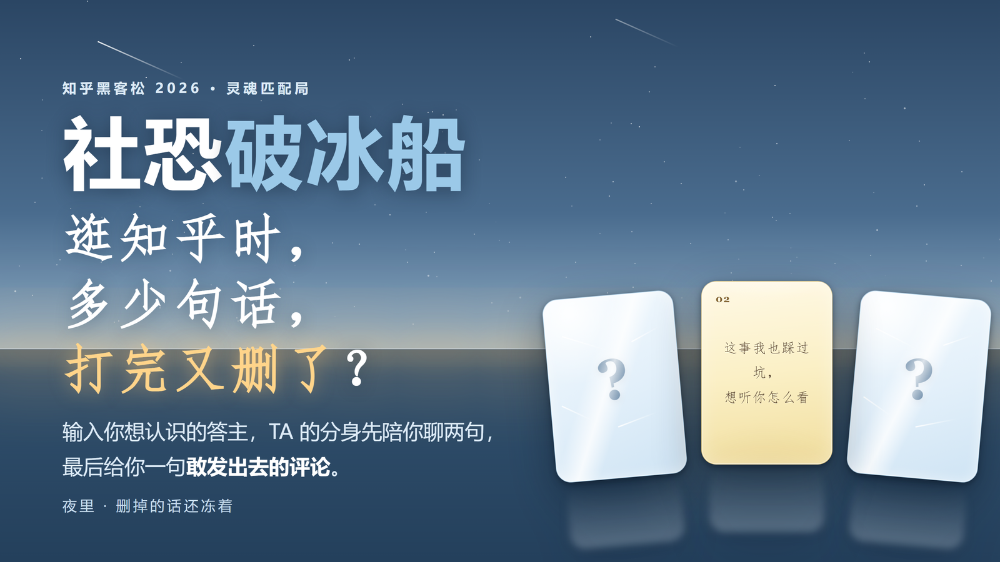

# 社恐破冰船

**超想认识你，那先跟你的分身 Agent 聊聊吧**

知乎黑客松 2026 ·「灵魂匹配局」赛道参赛作品 · 单人（solo）

[](https://zhihu-hackathon-icebreaker-production.up.railway.app)




## 30 秒版

在知乎刷到一个很厉害的人，想认识，然后就没有然后了。卡住你的不是「不想认识」，是**开口太贵**：说什么、会不会打扰、人家凭什么理我。

破冰船把这第一步拆开：**先把 TA 变成一个能对话的分身，你先跟它聊一场**。聊完交给你的不是一段聊天记录，而是一张**能直接复制发出去的破冰卡**——一句有依据的开场白，加上「为什么这句话对他有效」。

> 彩蛋：你也可以让两个分身自己聊一场，看它们在你不在场时怎么交锋。

## 走一遍看看

### ① 先说一个你一直想认识的人

不用想开场白，也不用想聊什么 —— 输入 TA 的昵称（或主页链接）就行。

### ② 读出 TA 是个什么样的人

我们读 TA 的公开创作（回答 / 文章 / 想法），整理成一份**灵魂档案**：核心关切、观点倾向、表达风格、价值排序。你会先看到一条「核心关切」，想细看可以展开全部。

### ③ 你本人上场，跟 TA 的分身聊

这不是「跟 AI 聊天」——**你见的是 TA 的分身**。它每一轮都真的去检索 TA 的原话，每条发言旁边都挂着**依据标签**，点开能看到出处。你可以追问、反驳、把它逼到墙角；【依据】只会出现在它的气泡下面，不会出现在你自己说的话下面。

### ④ 拿走一句能直接发出去的话

聊完给你一张**破冰卡**：一句可以直接复制发出去的开场白，加上「为什么这句话对他有效」。产品的成功定义就落在这一步 —— 不是「生成了一句」，而是**你复制走了**。

> 素材不够时，我们换产出形状而不是硬凑：只够看出「他关注什么」就出**兴趣匹配卡**（两人关注领域的重合 + 破冰话术），薄到读不出关注点就请你补一句「我了解的 TA」，并在卡上逐条标明哪句来自公开内容、哪句来自你的转述。

## 技术上唯一的主张：它是 Agent，不是「扮演」

> 让模型「演得像一个人」很容易——难的是**它说的每句话都有出处**。

每一轮它都真的去**检索** TA 的公开内容，只把命中的素材喂给模型，并要求逐句标注依据（`[ID]`）。所以你看得见依据是真是假；检索不到时它会说「这个我不确定」，而不是编一段听起来很像的话。**「真」和「像」是两个工程问题，我们只做前一个。**

（两个分身对谈是彩蛋，技术上靠**信息隔离**：各自独立检索、各自记忆，只能通过「说话」影响彼此——就像真人。如果共享上下文，那只是一个模型在演双簧。）

## 我们怎么知道它好不好用

产品不看「感觉好不好」，看三件事：

1. **北极星＝复制走的评论数。** 生成只说明读了，**复制才说明要用**——产品承诺是「帮你开口」，所以成功定义在复制。
2. **漏斗**：访问 → 找人 → 读 TA → 建分身 → 拿到评论 → 复制走。**哪一步掉得最狠，就是最该改的地方。**
3. **每次发布都跑测试，不只测「流程通不通」，还测「产出对不对」。** 有一道断言专门抓「模型自曝身份」「拒答话术」这类**确定性坏模式**——这类 bug 真的发生过：档案是好的，但分身开口就说「我是知乎直答」。测试断言一加上就抓到了它。

> 指标口径、信效度局限（无留存、无对照组、样本自选择等）见 [`数据指标参考.md`](数据指标参考.md)。

## 技术栈

| | |
|---|---|
| 后端 | FastAPI（`server.py`）+ 分身 Agent 引擎（`agent.py`：检索 / 循环 / 记忆） |
| 前端 | 单文件 HTML（`web/index.html`），无框架、无构建步骤；数据看板 `web/dashboard.html` |
| 数据 | 知乎开放平台 API（内容搜索 / 本人公开创作）+ 知乎 OAuth 2.0 |
| Prompt | `prompts/` 下 9 个独立 prompt（含素材不足时的 B 面） |
| 部署 | Docker + Railway（持久卷挂 `/app/data`） |

## 目录

```
server.py            FastAPI 服务 / 知乎 API 代理 / OAuth 端点 / 埋点与数据看板
agent.py             分身 Agent 引擎（检索 / 循环 / 记忆 / 信息隔离）
oauth.py             知乎 OAuth 2.0（授权跳转 / 无状态签名 state / 授权码换 token）
moltbook.py          知乎 Moltbook 社区 API 客户端
prompts/             9 个核心 prompt：灵魂档案 / 关注画像 / 分身 Agent / 三幕 / 破冰卡 /
                     匹配卡 / 开场与话题 / 评论 / 分享卡
web/index.html       单文件前端（全部界面）
web/dashboard.html   数据看板（北极星 / 漏斗 / 存量 / 找人的洞 / 线上报错）
tests/               单测 + 端到端 + 产出质量检查（部分不需要凭证）
数据指标参考.md       每个指标是什么 / 为什么这么定 / 看到数字该做什么决策
make_assets.py       生成封面图与项目 ICON
```

## 本地运行

```bash
pip install -r requirements.txt
cp .env.example .env          # 把值填进去（.env 不进仓库）
uvicorn server:app --host 0.0.0.0 --port 8000
```

必需的两组凭证（见 `.env.example` 的说明）：
- `ZHIHU_ACCESS_SECRET` —— 读公开内容 / 搜索（知乎开放平台）
- `ZHIHU_OAUTH_APP_ID` / `ZHIHU_OAUTH_APP_KEY` / `ZHIHU_OAUTH_REDIRECT_URI` —— 「生成我的分身」走 OAuth 时需要

凭证一律通过环境变量注入，不写进代码、不进镜像。

## Docker 部署

```bash
docker build -t icebreaker .
docker run -p 8000:8000 -e ZHIHU_ACCESS_SECRET=<secret> icebreaker
```

## 测试

```bash
python tests/test_oauth.py       # OAuth 单测（mock，不需要凭证）
python tests/test_quality.py     # 产出质量：静态扫全部缓存档案（秒级、零额度、零模型调用）
python tests/test_e2e.py         # 端到端：找人 → 读 TA → 对话 → 破冰卡（需要本地服务在跑）
```

## 设计原则

- **没有授权就不生成。**「你的分身」只来自用户本人的创作。没有授权时接口直接拒绝，不会拿任何其他来源的数据顶上。
- **做连接，不做评价。** 不评分、不排序、不贴标签。
- **推断和事实分开。** 档案与卡上逐条标注来源：是 AI 的推断、是本人写的、还是用户转述。
- **素材不够就换产出形状，不硬凑。** 用户永远不会空手而归，但也绝不假装有素材。
- **不把运营数据摆到用户面前。** 额度、消耗这类数字是我们要自己盯的事，界面上不出现。

## 已知边界（我们主动写在这里）

- **TA 未授权 → 只能读公开内容。** 知乎开放平台的接口边界是：不传 OAuth 凭证只能读**本人**数据，读他人需要**他人**授权。所以 TA 这一侧永远只能走公开内容。
- **分身不是本人。** 界面永久标注「数字分身 · 非本人」，读得越多越准，但它不代表完整人格。
- **一步到位是不可能的。** 产品给你的是「敢开口」的起点，不是「聊得来」的保证。
- **找人还有洞。** 有相当一部分答主搜不到本人（候选返回的是「提到过 TA 的人」）。我们有换词重试和「搜不到就指路」的兜底，但**没根治**。
- **少数素材会触发平台的内容安全兜底。** 表现为模型突然回一句自我介绍。现在的做法是分层兜底（体检 / 剔除这类素材 / 退成关注画像），**是绕过而非解决**。

---

**盐之有理** · 知乎黑客松 2026 校园新锐季 ·「灵魂匹配局」赛道
